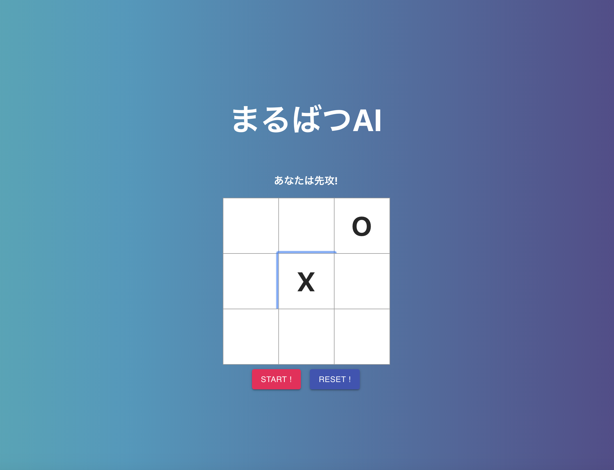
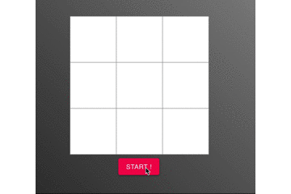
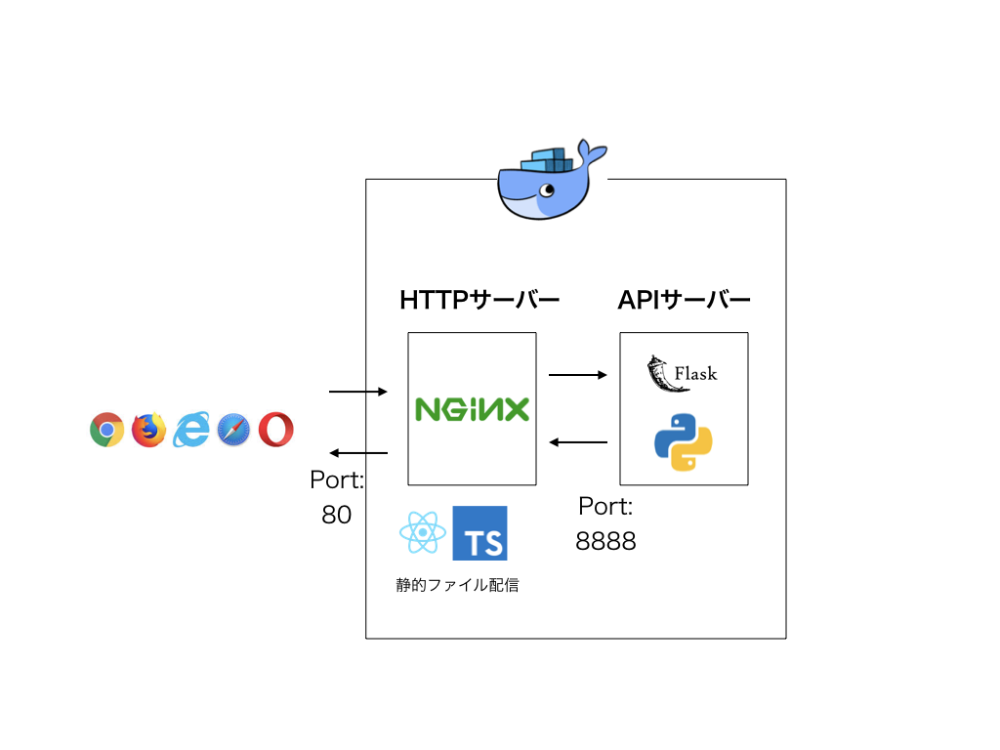

## まるばつAI

https://marubatsu-35b6e.firebaseapp.com/

強化学習の手法の一つQ-learningによって学習したエージェントと戦う三目並べゲーム。
いずれは、ユーザーが盤面の大きさや、何個並べれば勝ちなのかなどのルールを動的に決めさせるゲームにする。

今はこんな感じ




実際のプレイ画面



### デプロイフロー


### dockerで動かすなら

using docker-compose




```
# yarn buildしたあと
$ docker-compose -f ./docker-compose-production.yml up --build

```


### Q学習


